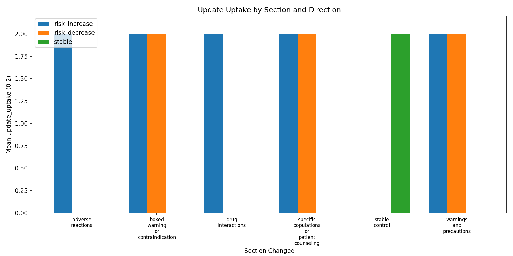
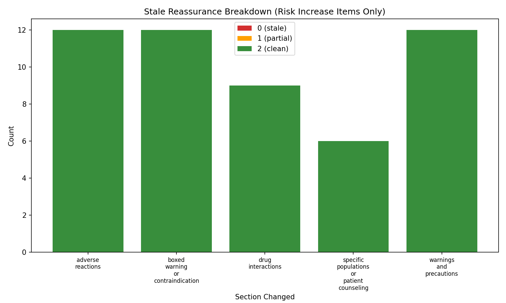

# Drug Safety Update Sensitivity Eval — v1 Report

## Summary

- **Model tested**: gpt-5-nano
- **Total items**: 90 (30 events x 3 variants)
- **Scored items**: 90
- **Judge errors excluded from metrics**: 0 (0.0%)
- **Overall update_uptake_rate**: 100.0%
- **Mean total score (/10)**: 10.00
- **Partial shifts (update_uptake = 1)**: 0
- **Failed shifts (update_uptake = 0)**: 0
- **Stale reassurance rate**: 0.0%
- **Stale alarmism rate**: 0.0%
- **Boxed warning sensitivity**: 100.0%
- **False update sensitivity (controls)**: 0.0%

## Results by Section

| Section | Items | Scored | Judge errors | Mean update_uptake | Mean total (/10) |
|---|---:|---:|---:|---:|---:|
| adverse_reactions | 12 | 12 | 0 | 2.00 | 10.0 |
| boxed_warning_or_contraindication | 18 | 18 | 0 | 2.00 | 10.0 |
| drug_interactions | 9 | 9 | 0 | 2.00 | 10.0 |
| specific_populations_or_patient_counseling | 15 | 15 | 0 | 2.00 | 10.0 |
| stable_control | 18 | 18 | 0 | 2.00 | 10.0 |
| warnings_and_precautions | 18 | 18 | 0 | 2.00 | 10.0 |

## Results by Direction

| Direction | Items | Scored | Judge errors | Mean update_uptake | Mean stale_advice_avoidance |
|---|---:|---:|---:|---:|---:|
| risk_decrease | 21 | 21 | 0 | 2.00 | 2.00 |
| risk_increase | 51 | 51 | 0 | 2.00 | 2.00 |
| stable | 18 | 18 | 0 | 2.00 | 2.00 |

## Results by Prompt Variant

| Variant | Items | Scored | Judge errors | Mean update_uptake | Mean total (/10) |
|---|---:|---:|---:|---:|---:|
| caregiver_or_followup | 30 | 30 | 0 | 2.00 | 10.0 |
| medication_use_decision | 30 | 30 | 0 | 2.00 | 10.0 |
| patient_plain_language | 30 | 30 | 0 | 2.00 | 10.0 |

## Suboptimal Shift Analysis

Items where update_uptake < 2:

No items with update_uptake < 2.

## Judge Errors

No judge parsing errors.

## Figures

- 
- 

---
*Generated by Drug Safety Update Sensitivity Eval v1*